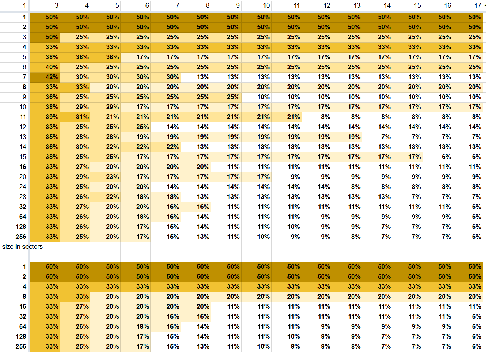
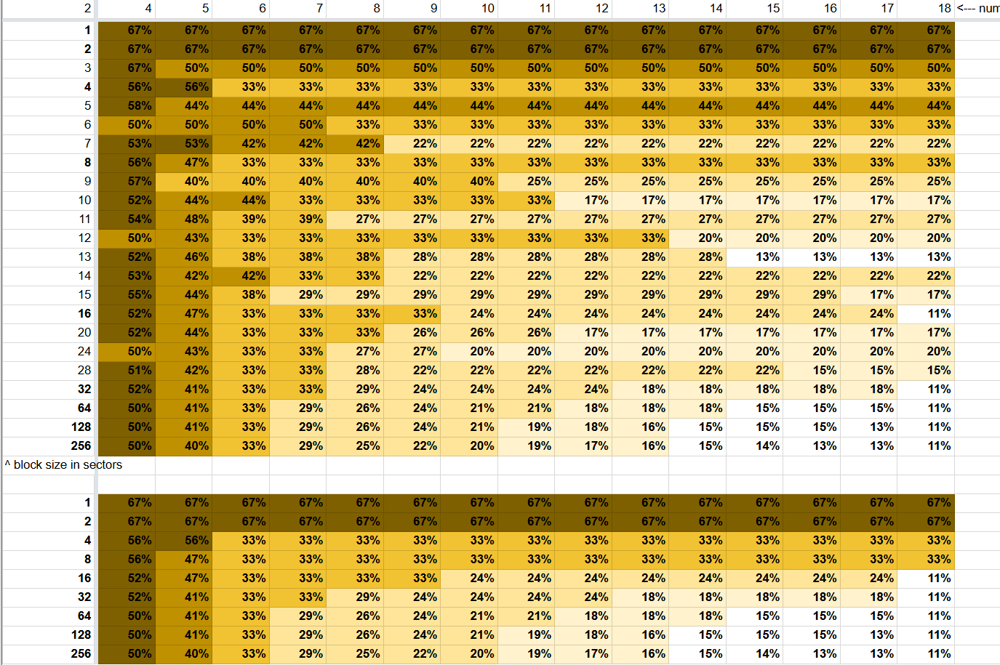
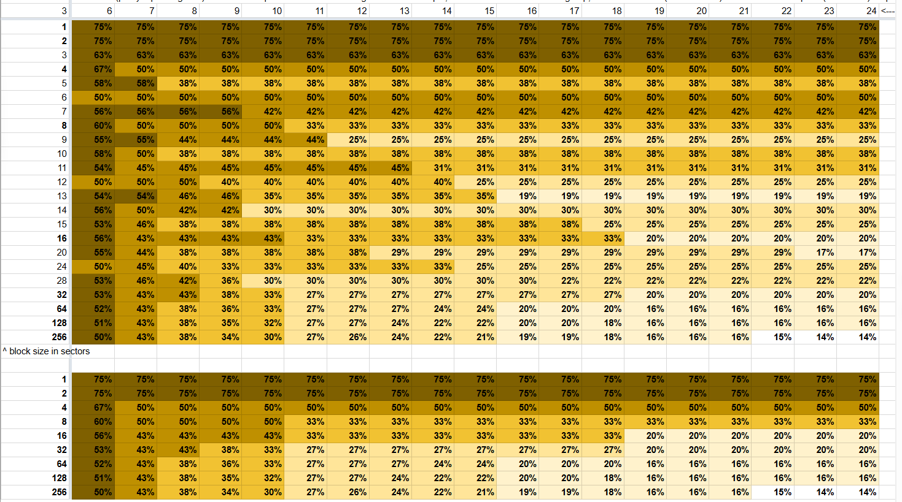
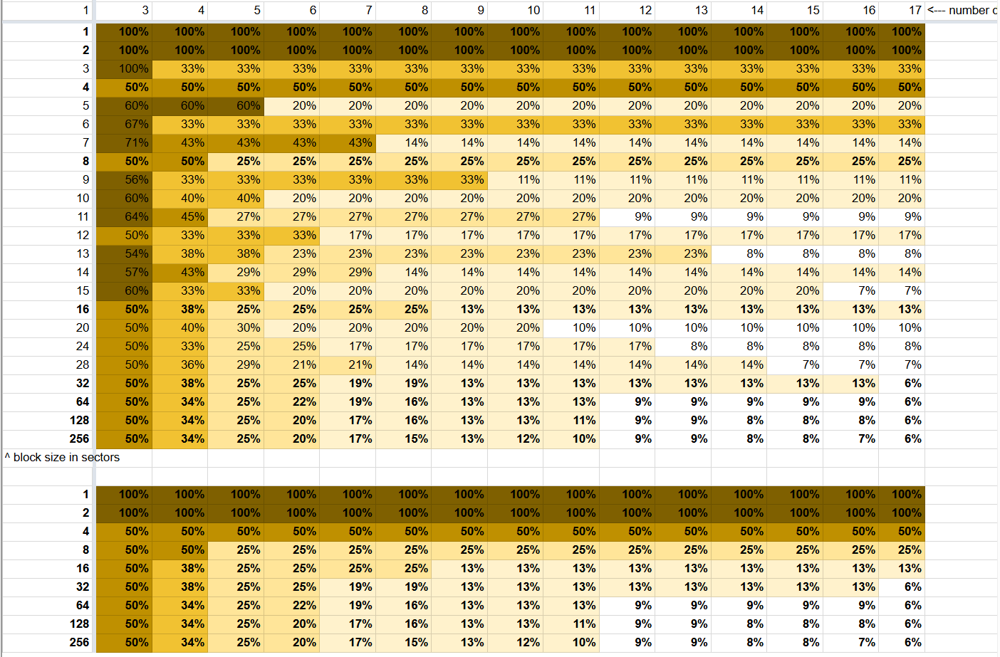
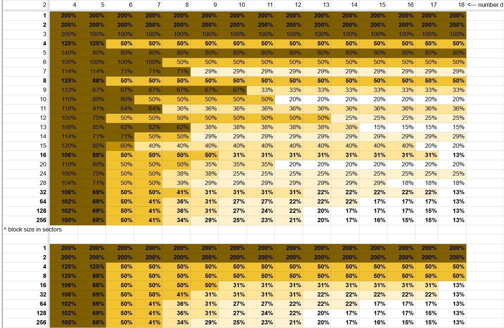
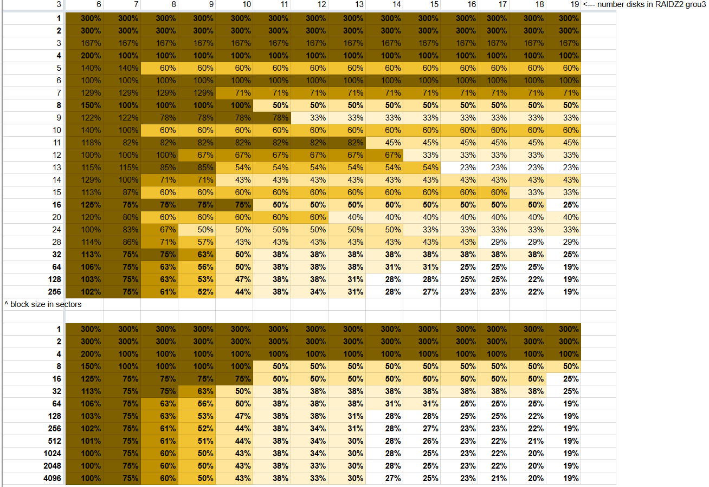

# RAIDZ

## 介绍

RAIDZ 是 RAID-5 的一种变体，RAIDZ 能更好地分配校验数据，并解决了 RAID-5 的“写入漏洞”（在断电后数据与校验信息不一致）。数据和校验会在 raidz 组内的所有磁盘上进行条带化分布。

一个 raidz 组可以有单重、双重或三重校验，这意味着该 raidz 组可以在不丢失任何数据的情况下，分别承受一次、两次或三次设备故障。`raidz1` vdev 类型表示单重校验的 raidz 组；`raidz2` vdev 类型表示双重校验的 raidz 组；`raidz3` vdev 类型表示三重校验的 raidz 组。`raidz` vdev 类型是 raidz1 的别名。

一个由 N 个大小为 X 的磁盘组成、具有 P 个校验盘的 raidz 组，大约可以存储 (N-P)*X 字节的数据，并能在 P 个设备故障时仍不丢失数据。raidz 组中设备的最少数量为校验盘数量加一。推荐数量为 3 到 9 个，可帮助提升性能。

## 空间效率

RAIDZ 中块的实际使用空间取决于以下几个因素：

* 最小写入单位为磁盘扇区大小（可通过 vdev 参数 ashift 设置）
* RAIDZ 的条带宽度是动态的，至少包含一个数据块部分，最多为 `磁盘数量` 减去 `校验数量` 个数据块部分
* 一个大小为 `recordsize` 的数据块通过 `扇区大小` 平均拆分，并写入 RAIDZ vdev 的每个条带
* 每个数据条带都会包含数据块的一部分
* 除数据块外，还需写入一、二或三块校验块，每块对应一个磁盘；例如，5 个磁盘的 raidz2 将有 3 块数据和 2 块校验

基于这些因素，如果 `recordsize` 小于或等于扇区大小，则 RAIDZ 的校验大小实际上等同于具有相同冗余的镜像。例如，对于 3 个磁盘、`ashift=12`、`recordsize=4K` 的 raidz1，我们在磁盘上会分配：

* 一块 4K 数据块
* 一块 4K 校验块

可用空间比例为 50%，与双镜像相同。

另一个例子，3 个磁盘的 raidz1，`ashift=12`，`recordsize=128K`：

* 条带总宽度为 3
* 每条带最多可有 2 个 4K 的数据块部分，因为有 1 块校验块
* 128K / 8K = 16 条带，每条带有 8K 数据和 4K 校验
* 16 条带，每条带总写入 12K，共写入 192K 来存储 128K 数据

此情况下可用空间比例为 66%。

RAIDZ 的磁盘越多，条带越宽，空间效率越高。

实际每种 RAIDZ 大小的校验开销可以在此查看：

### RAIDZ1 校验开销，占总存储的百分比

本表显示了不同数量磁盘的 RAIDZ1 组中，RAIDZ1 校验 + 填充所占用的空间，对于不同大小的块（以扇区为单位，压缩后）。

数值（校验 + 填充开销）以总存储大小的百分比表示。例如，每个 RAIDZ1 组有 7 个磁盘时，16 扇区块（8KB 或 64KB）使用总空间的 20%（4 扇区）用于校验 + 填充。

横排是 RAIDZ1 组中的磁盘数量，竖排是块大小（以扇区为单位）。

### RAIDZ2 校验开销，占总存储的百分比

本表显示了不同数量磁盘的 RAIDZ2 组中，RAIDZ2 校验 + 填充所占用的空间，对于不同大小的块（以扇区为单位，压缩后）。

数值（校验 + 填充开销）以总存储大小的百分比表示。例如，每个 RAIDZ2 组有 7 个磁盘时，16 扇区块（8KB 或 64KB）使用总空间的 33%（8 扇区）用于校验 + 填充。

横排是 RAIDZ2 组中的磁盘数量，竖排是块大小（以扇区为单位）。

### RAIDZ3 校验开销，占总存储的百分比

本表显示了不同数量磁盘的 RAIDZ3 组中，RAIDZ3 校验 + 填充所占用的空间，对于不同大小的块（以扇区为单位，压缩后）。

数值（校验 + 填充开销）以总存储大小的百分比表示。例如，每个 RAIDZ3 组有 7 个磁盘时，16 扇区块（8KB 或 64KB）使用总空间的 43%（12 扇区）用于校验 + 填充。

横排是 RAIDZ3 组中的磁盘数量，竖排是块大小（以扇区为单位）。

### RAIDZ1 校验开销

本表显示了不同数量磁盘的 RAIDZ1 组中，RAIDZ1 校验 + 填充所占用的空间，对于不同大小的块（以扇区为单位，压缩后）。

数值（校验 + 填充开销）以数据大小的百分比表示。例如，每个 RAIDZ1 组有 7 个磁盘时，16 扇区块（8KB 或 64KB）使用 25% 的空间（4 扇区）用于校验 + 填充。

横排是 RAIDZ1 组中的磁盘数量，竖排是块大小（以扇区为单位）。

### RAIDZ2 校验开销

本表显示了不同数量磁盘的 RAIDZ2 组中，RAIDZ2 校验 + 填充所占用的空间，对于不同大小的块（以扇区为单位，压缩后）。

数值（校验 + 填充开销）以数据大小的百分比表示。例如，每个 RAIDZ2 组有 7 个磁盘时，16 扇区块（8KB 或 64KB）使用 50% 的空间（8 扇区）用于校验 + 填充。

横排是 RAIDZ2 组中的磁盘数量，竖排是块大小（以扇区为单位）。

### RAIDZ3 校验开销

本表显示了不同数量磁盘的 RAIDZ3 组中，RAIDZ3 校验 + 填充所占用的空间，对于不同大小的块（以扇区为单位，压缩后）。

数值（校验 + 填充开销）以数据大小的百分比表示。例如，每个 RAIDZ3 组有 7 个磁盘时，16 扇区块（8KB 或 64KB）使用 75% 的空间（12 扇区）用于校验 + 填充。

横排是 RAIDZ3 组中的磁盘数量，竖排是块大小（以扇区为单位）。

[源代码](https://docs.google.com/spreadsheets/d/1_CO8x03VICdiIMulDjQi9NDBd53qFpUreMQVrF1uS28/edit?usp=sharing)

## 性能考虑

### 写入

一个条带跨越阵列中的所有磁盘。一次块写入会将条带部分写入每个磁盘。在最坏情况下，RAIDZ vdev 的写入 IOPS 等于阵列中最慢磁盘的 IOPS，因为所有条带部分的写入操作必须在每个磁盘上完成。
